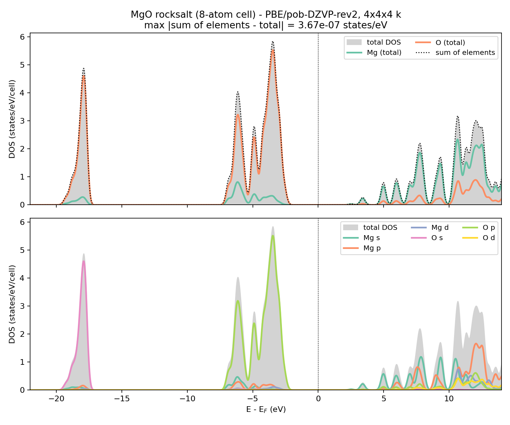

# MgO — total DOS and projected DOS (PDOS)

Sample output for the **Density of States Plotter** page of RIPER-Tools. Drop *all* the
`dos` and `pdos_*` files of this folder into the plotter at once — they are recognised
automatically.



## The system

MgO in the rocksalt structure, described with the **conventional cubic cell** (4 Mg + 4 O,
`a = 7.95952644 bohr = 4.212 Å`) rather than the 2-atom primitive cell, so that the example
actually exercises the summation of several equivalent atoms into one element curve.

PBE / pob-DZVP-rev2, RI-J with the universal auxiliary basis, 4×4×4 k-mesh.

## How these files were produced

The relevant part of `control`:

```
$dosper  width=0.008 npt=1200 fermishift emin=-0.45 emax=0.95
$pdosper
  atoms    1,5
  elements mg,o
  resolve  shell
```

`$pdosper` always needs `$dosper`: the energy grid, the broadening, the scaling and the
Fermi shift are taken from it, so the total and the projected DOS are guaranteed to live on
the same grid.

Then, reusing the converged orbitals in `mos`:

```bash
riper -proper > output
```

`atoms 1,5` selects one Mg and one O (atoms 1–4 are Mg, 5–8 are O); `elements mg,o` adds the
element-summed curves. Leaving both lists out would have written a file for *every* atom and
*every* element instead.

## The files

| file | content |
|---|---|
| `control`, `coord`, `basis`, `auxbasis`, `mos` | the complete input, so the run can be repeated |
| `output` | the `riper` output, including the PDOS banner and the sum-rule check |
| `dos` | total DOS: `E-Ef`, total, s, p, d |
| `pdos_el_mg`, `pdos_el_o` | element projected, summed over the four atoms of that element |
| `pdos_at1_mg`, `pdos_at5_o` | atom projected, one Mg and one O |
| `pdos_at1_mg_sh1 … _sh7` | the seven contracted shells of Mg 1: s, s, s, s, p, p, d |
| `pdos_at5_o_sh1 … _sh6` | the six contracted shells of O 5: s, s, s, p, p, d |

Each file carries a self-describing header, for example

```
#     PDOS  shell 4 (p) of atom 5 o  (Mulliken)
#     E - Ef       total
# Ef =         0.3840051148
```

For a spin-unrestricted (UKS) run every name additionally appears with the suffixes
`_a+b`, `_a-b`, `_alpha` and `_beta`, exactly as for the total DOS.

## What the numbers show

The projection is a Mulliken decomposition, so the pieces are exact partial sums of the
total DOS. At the top of the valence band (`E - Ef = -0.12758` Ha, i.e. -3.47 eV) the
element curves add up column by column:

```
                    total          s          p          d
dos              159.22405    1.14325  154.85063    3.23017
pdos_el_o        150.59242    0.19154  150.16664    0.23424
pdos_el_mg         8.63163    0.95170    4.68399    2.99593
                 ---------  ---------  ---------  ---------
sum              159.22405    1.14324  154.85063    3.23017
```

so the valence band is **94.6 % O**, and the O part is **99.7 % p** — the O 2p band, with a
small Mg admixture that is the covalent contribution to the bonding. Each individual atom
carries one quarter of its element total (`pdos_el_o` / 4 = 37.64811 = `pdos_at5_o`),
because the four O atoms are symmetry equivalent. Above the gap the picture inverts and the
conduction band is mostly Mg 3s.

`riper` prints the corresponding check in `output`:

```
PDOS sum rule, max |sum of shells - total DOS| =   5.0449E-13
```

Note that individual *shell* populations may be negative in places (`pdos_at1_mg_sh3` dips to
-3.18, `pdos_at5_o_sh3` to -0.81). This is a normal property of a Mulliken decomposition with
diffuse contracted shells; only the sums over shells are guaranteed to be positive.

## Reproducing the plot

The reference figure above was made with the plotter page, but the data are plain text, so
any tool works. Comment lines start with `#`; the first column is the energy (in Hartree,
already referenced to E<sub>F</sub> because `fermishift` was used) and the remaining columns
are the DOS in states/Hartree.
